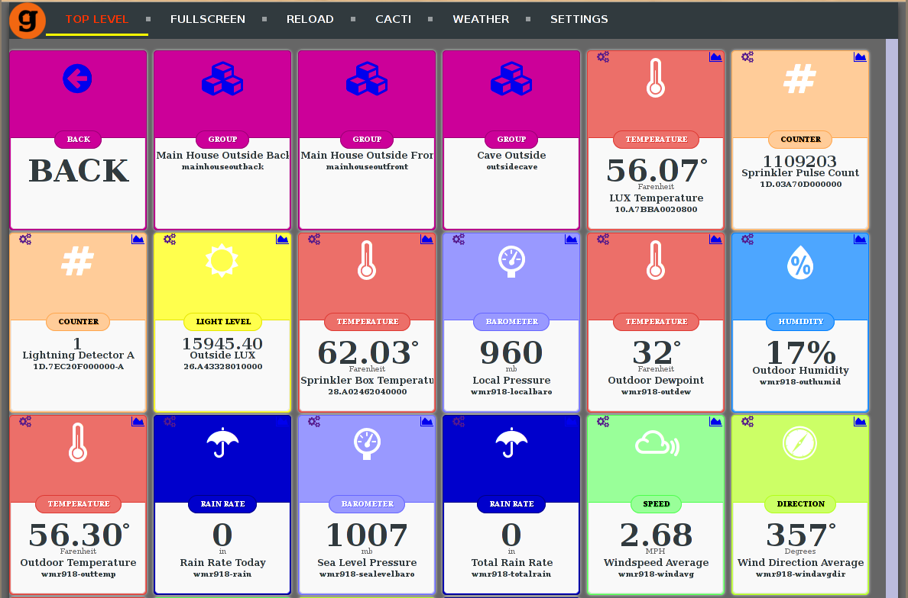
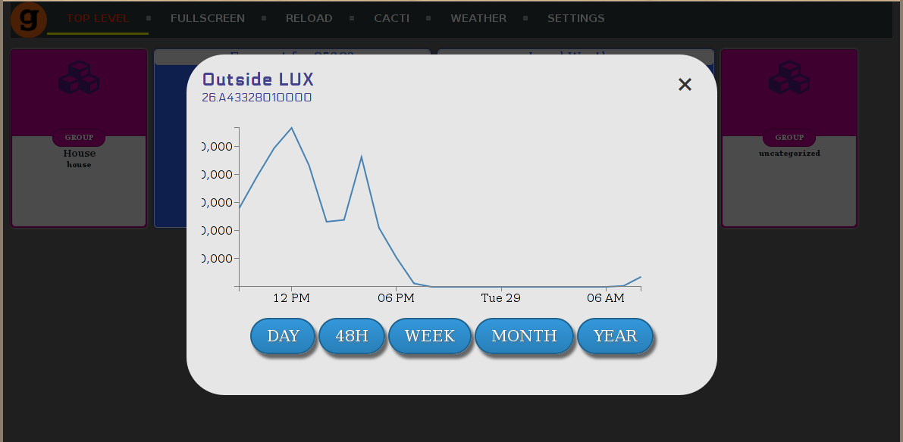
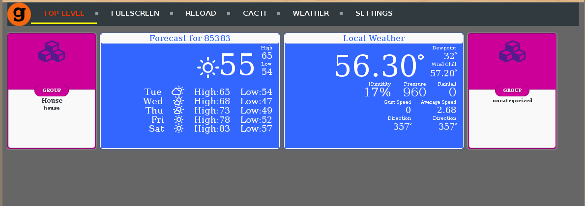
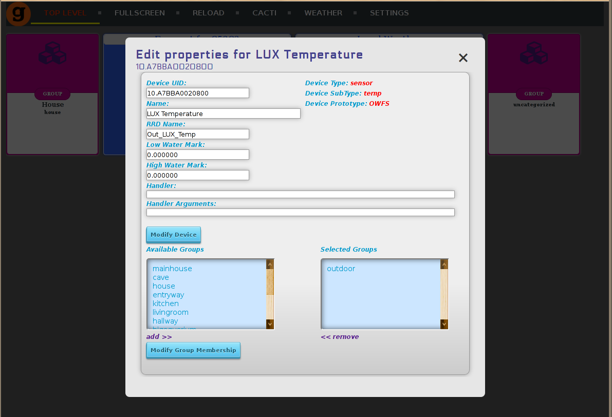
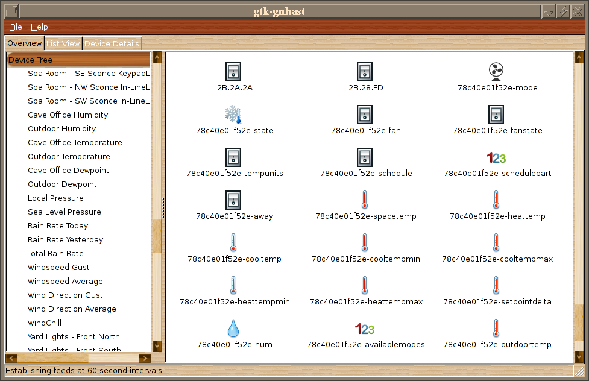
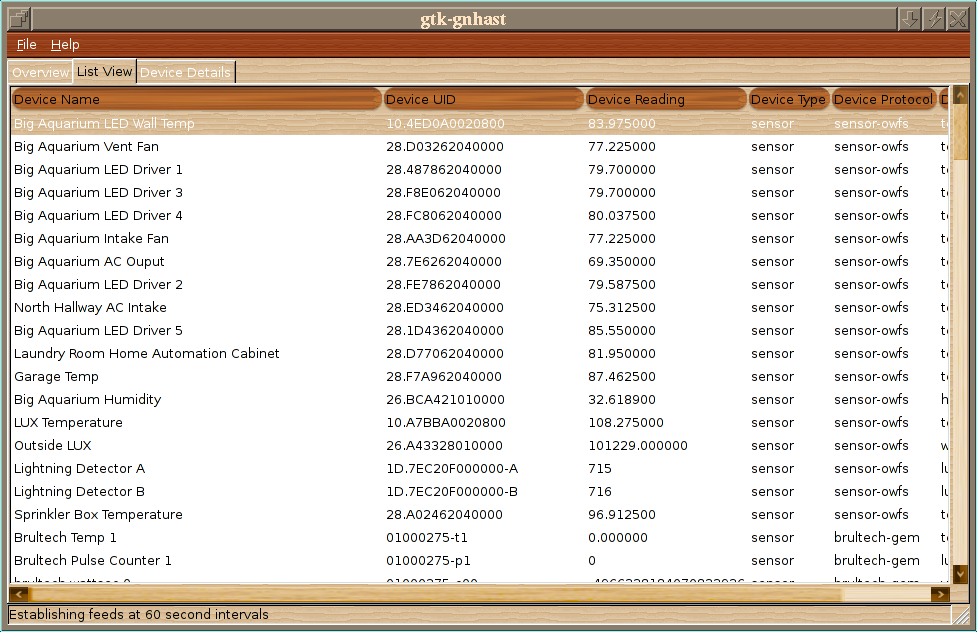

# Gotta have screenshots

* gnhastweb view of a bunch of devices

* gnhastweb showing a data graph built on the fly

* gnhastweb showing the home screen, with the forecast and weather widgets active

* Editing a device's properties in gnhastweb

* gtk-gnhast overview window

* gtk-gnhast list view window